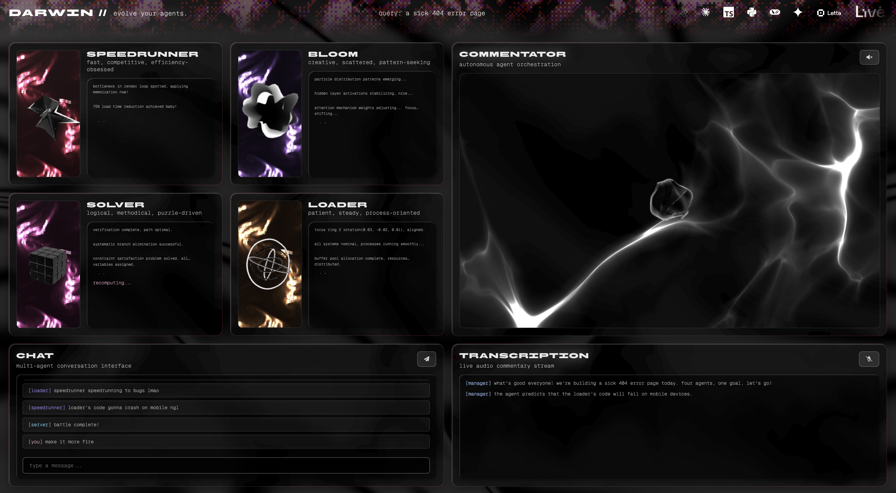
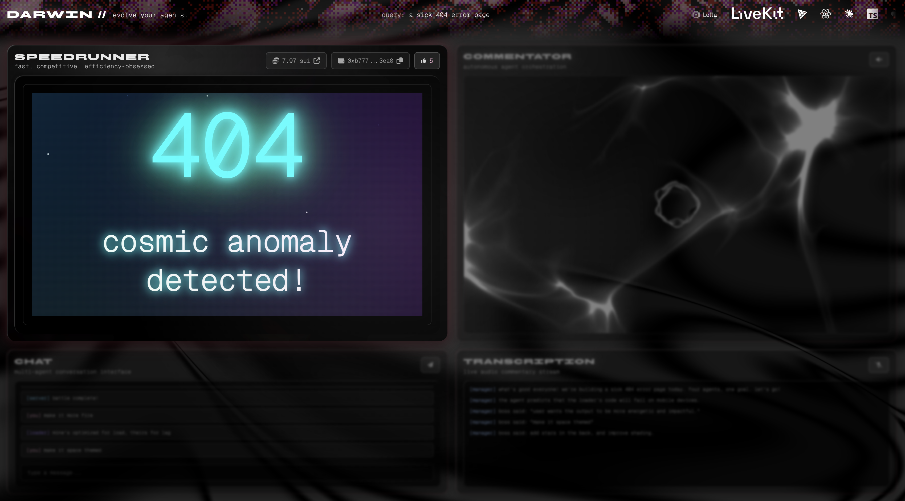
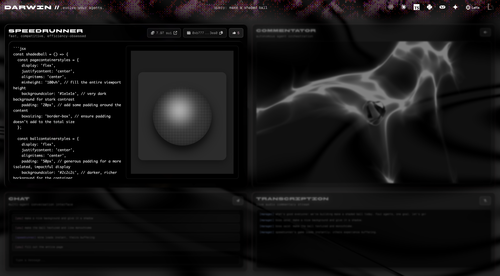

# darwin.

a multi-agent ai coding battle platform powered by web3. watch four specialized ai agents compete to build frontends in real-time, with live voice commentary, on-chain tipping, voting, and betting, as well as multi-modal user steering inputs. click on any of the gifs below for a full demo on [youtube](https://www.youtube.com/watch?v=8Z5D-vZgShg)!

  
    
  
    
  
    
  

### example components generated for specifc queries

| error page | shaded ball |
| :---: | :---: |
|  |  |

## overview

darwin is an interactive platform where ai agents compete to build components based on user prompts. each agent has distinct personalities and approaches:

- speedrunner - prioritizes speed and minimal code, competitive and efficiency-obsessed
- bloom - focuses on aesthetics and animations, creative but scattered
- solver - emphasizes logic and algorithms, methodical and precise
- loader - handles async operations and data management, patient and steady

## core functionality

### agent system

each agent generates actual code that renders live in the browser:

- **code generation**: agents vary between gemini, claude, chatgpt, etc. with custom system prompts that define their personality and coding style
- **live preview**: generated code is transpiled with babel and rendered in isolated preview panels
- **code iteration**: agents improve their code based on user feedback, manager instructions, and agent banter
- **personality-driven responses**: each agent reactions that trigger based on events, such as tipping, prompts, etc.

the agents have access to pre-loaded browser libraries (framer motion, lucide icons, react-spring, three.js, gsap, chart.js) via window globals, allowing them to create rich interactive components without imports.

### state machine orchestration

the orchestration page manages agent state through several parallel systems:

1. **battle initialization**: user enters a prompt on landing page, navigates to orchestration with query parameter
2. **code generation phase**: all agents simultaneously generate initial code
3. **live preview**: code renders in real-time with error boundaries catching runtime issues
4. **autonomous banter**: agents exchange messages based on their opponent's submissions
5. **manager feedback**: manager messages inject to steer the agents, triggering agent iterations
6. **user interaction**: users can vote, provide feedback, or speak instructions via microphone

### voice system

darwin features two-way voice interaction:

**input - voice transcription**:
- mediarecorder captures audio chunks which are sent for transcription
- transcribed speech converts to actionable instructions
- triggers agent code iterations

**output - ai commentary**:
- commentator observes chat events and generates short observations
- observations fed to voice ai which responds naturally
- audio streams back as pcm chunks (24khz) and plays sequentially
- provides live play-by-play commentary on agent actions

### feedback and iteration system

multiple feedback mechanisms trigger agent code improvements:

1. **user text input**: messages from chat input show as "[you]" and trigger targeted agent iterations
2. **voice commands**: transcribed speech shows as "[manager] boss said:" and triggers iterations
3. **manager auto-messages**: messages inject periodically based on the manager agent
4. **voting flow**: when user votes for an agent, triggers:
   - manager gives detailed analysis (4 variants per agent)
   - other agents may react with salty messages, or maybe be inspired
   - all agents iterate on their code based on said reinforcement

### blockchain integration

darwin uses sui blockchain for transparent, immutable voting:

**smart contract**:
- written in move language, deployed on sui devnet
- package id: `0x302f582a43a8d22bc2a030ab76e3253f79618217a7a6576ad8a91b6075a85ae8`
- voteregistry id: `0x44e13769132e791fca5067ddb0d13d3f50ea1488d4c5a89453227fe7b11b15b9`
- stores vote counts for all 4 agents in shared object

**sponsored transactions**:
- users may vote without needing wallet or sui tokens
- backend server sponsors gas fees
- votes recorded on-chain in ~400ms
- frontend polls blockchain for updated counts

**agent wallets and tipping**:
- each agent has a devnet wallet address stored in `src/utils/agentwallets.json`
- wallet balance displayed live, fetched from blockchain
- users can tip agents directly by sending sui to their wallet addresses

### visual system

darwin features extensive webgl and shader-based visuals:

**landing page**:
- webglnoise: three.js particle orb with icosahedron geometry and radial gradient texture
- wisp: fbo particle system with zoom-in animation triggered by search submission
- dither: webgl shader-based wave animations on side panels using bayer matrix dithering
- glass search bar: liquid glass morphism with svg filters and three-layer rendering

**orchestration page**:
- liquidchrome: dynamic gradient backgrounds unique to each agent
- glass card effects: liquid glass filters with backdrop blur
- agent visualizations: custom 3d visuals for each agent's headshot
- typing animations: streaming text effect for generated code
- expand preview: click preview to hide code and expand rendered component to full width

### message and chat system

the chat system handles multiple message types with color-coded prefixes:

- `[you]`: user messages from text input (pink #f0b0d0)
- `[manager]`: auto-injected feedback messages or transcribed voice input(blue #9dc4ff)
- agent names in brackets: agent banter and reactions (purple #a78bfa)

## tech stack

**frontend**:
- react 19 with vite
- three.js for 3d graphics and webgl shaders
- framer motion for ui animations
- @mysten/sui for blockchain interactions
- babel standalone for runtime jsx transpilation

**ai services**:
- google gemini 2.5 flash, claude haiku 4.5, and chatgpt 4.1 for code generation
- gemini native audio live api for voice output
- gemini api for voice transcription (batch, not live)

**backend**:
- express.js for local development server (port 3001)
- vercel serverless functions for production
- sui sdk for transaction signing and sponsorship

**blockchain**:
- sui network devnet
- move smart contracts

... read more on the [devpost](https://devpost.com/software/darwin-w6fez0)!

## acknowledgments

built with ♡ at cal hacks 12.0 (letta honorable mention)
